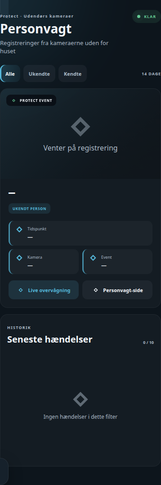

# HA Person Detection Card

## Neutral mobile preview



> Rendered at 390 px mobile width with fictional Home Assistant entities and values. No private dashboard, person, address, camera, or sensor data is included.


"Protect Personvagt" — 14 dages personhistorik med billeder fra UniFi Protect. Samme opbygning som [ha-license-plate-card](https://github.com/MRDonnii/ha-license-plate-card), men til persondetektion fra udendørskameraer i stedet for nummerplader: stor visning af seneste hændelse plus en filtrerbar liste over de sidste 10 (alle / ukendte / kendte personer).

Kortet er en ren visning oven på en sensor med et `events`-attribut — ingen direkte kald til UniFi Protect ud over det snapshot-billede sensoren selv leverer.

```yaml
type: custom:ha-person-detection-card
title: Personvagt
subtitle: Protect · Udendørs kameraer
entity: sensor.protect_personhistorik
live_navigation_path: /teknik-overblik/overvagning
```

## Forventet dataformat

`entity` skal være en sensor hvor state er antal aktive hændelser, og `attributes.events` er et array i denne form:

```json
{
  "event_id": "abc123",
  "camera": "Indkørsel",
  "known_name": "Bud",
  "event_time": "2026-09-01T08:15:00+02:00",
  "snapshot_url": "https://.../snapshot.jpg"
}
```

`known_name` og `snapshot_url` er valgfri — mangler `known_name`, vises hændelsen som "ukendt person"; mangler `snapshot_url`, vises et ikon i stedet for billede.

## Config

| Felt | Type | Standard |
|---|---|---|
| `title` | tekst | "Personvagt" |
| `subtitle` | tekst | "Protect · Udendørs kameraer" |
| `entity` | entity-id | `sensor.protect_personhistorik` |
| `live_navigation_path` | tekst | `/teknik-overblik/overvagning` |
| `navigation_path` | tekst | `/teknik-overblik/personer-i-haven` (bruges af "Personvagt-side"-knappen) |

## Installation

1. Kopiér `ha-person-detection-card.js` til `/config/www/ha-person-detection-card/`.
2. Tilføj som Lovelace-resource: `/local/ha-person-detection-card/ha-person-detection-card.js?v=1`, type `module`.
3. Tilføj kortet i en dashboard-view med din egen `entity`.
